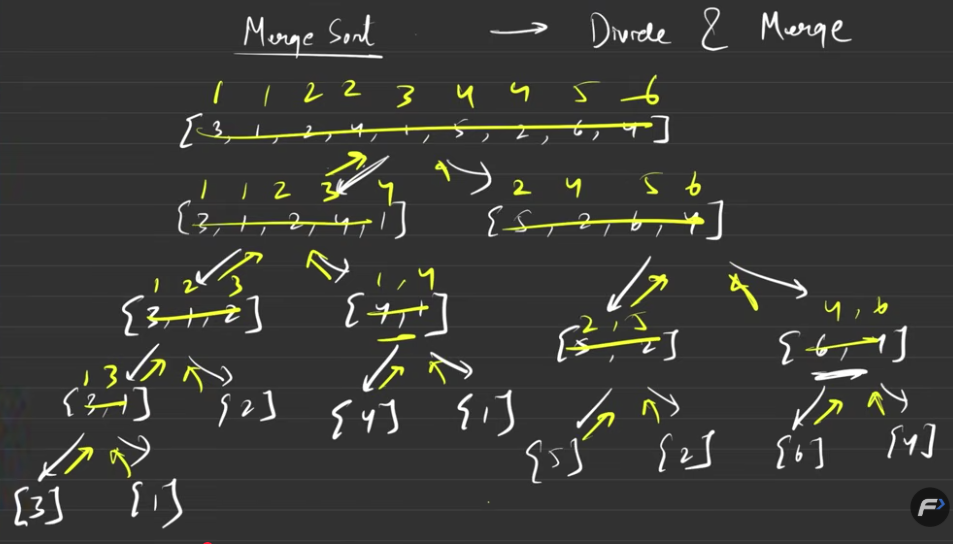

# Merge Sort --- Short Notes

## 1. Definition

**Merge Sort** is a sorting algorithm that uses **Divide and Conquer**:
it divides the array into smaller parts and then merges them back in
sorted order.

> **Remember: DIVIDE → MERGE**

------------------------------------------------------------------------


## 2. How it works

Example:

``` text
[3 1 2 4 1]
     ↓ divide
[3 1 2]   [4 1]
   ↓         ↓
[3 1] [2] [4] [1]
   ↓         ↓
 [1 3]     [1 4]
      ↓     ↓
     [1 1 3 4]   ← merge
```

The array is divided until every part has **one element**.

A single element is already sorted, so we stop.

### Base case

``` cpp
if (low >= high)
    return;
```

------------------------------------------------------------------------

## 3. Important indices

For a portion of the array:

``` text
low ........ mid ........ high
|-------------|-------------|
   left half      right half
```

``` cpp
int mid = (low + high) / 2;
```

Left half:

``` cpp
low ... mid
```

Right half:

``` cpp
mid + 1 ... high
```

------------------------------------------------------------------------

## 4. Merge Process

Suppose both halves are already sorted:

``` text
Left:  [1 3 4]
Right: [2 5]
```

Compare the first elements:

``` text
1 vs 2 → take 1
3 vs 2 → take 2
3 vs 5 → take 3
4 vs 5 → take 4
```

Then copy the remaining `5`.

Result:

``` text
[1 2 3 4 5]
```

### Merge rule

> **Compare → take smaller → move pointer → repeat**

------------------------------------------------------------------------

## 5. Merge Sort Code

``` cpp
void merge_sort(vector<int>& arr, int low, int high) {

    if (low >= high)
        return;

    int mid = (low + high) / 2;

    merge_sort(arr, low, mid);
    merge_sort(arr, mid + 1, high);

    merge(arr, low, mid, high);
}
```

### Merge function

``` cpp
void merge(vector<int>& arr, int low, int mid, int high) {

    vector<int> temp;

    int left = low;
    int right = mid + 1;

    while (left <= mid && right <= high) {

        if (arr[left] <= arr[right]) {
            temp.push_back(arr[left]);
            left++;
        }
        else {
            temp.push_back(arr[right]);
            right++;
        }
    }

    while (left <= mid) {
        temp.push_back(arr[left]);
        left++;
    }

    while (right <= high) {
        temp.push_back(arr[right]);
        right++;
    }

    for (int i = low; i <= high; i++)
        arr[i] = temp[i - low];
}
```

------------------------------------------------------------------------

## 6. Main Function

``` cpp
int main() {

    int n;
    cin >> n;

    vector<int> arr(n);

    for (int i = 0; i < n; i++)
        cin >> arr[i];

    merge_sort(arr, 0, n - 1);

    for (int x : arr)
        cout << x << " ";
}
```

> `vector<int> arr(n);` creates a vector with `n` elements.

------------------------------------------------------------------------

## 7. Why `vector<int>&`?

``` cpp
vector<int>& arr
```

means the function receives a **reference to the original vector**, so
no complete copy is made.

The `&` is important because Merge Sort needs to modify the original
array.

------------------------------------------------------------------------

## 8. Complexity

  Complexity    Value
  ------------- --------------
  Best          `O(n log n)`
  Average       `O(n log n)`
  Worst         `O(n log n)`
  Extra Space   `O(n)`

### Why `O(n log n)`?

-   Array is divided about `log₂ n` times.
-   Each level performs about `O(n)` merging work.

Therefore:

``` text
O(n) × O(log n) = O(n log n)
```

------------------------------------------------------------------------

## 9. Quick Revision

``` text
Merge Sort
    ↓
Divide array
    ↓
Until one element
    ↓
Merge sorted parts
    ↓
Sorted array
```

### Remember these 4 lines:

``` cpp
if (low >= high) return;

int mid = (low + high) / 2;

merge_sort(arr, low, mid);
merge_sort(arr, mid + 1, high);

merge(arr, low, mid, high);
```

**Core idea:**\
\> **Divide until single elements, then merge in sorted order.**
